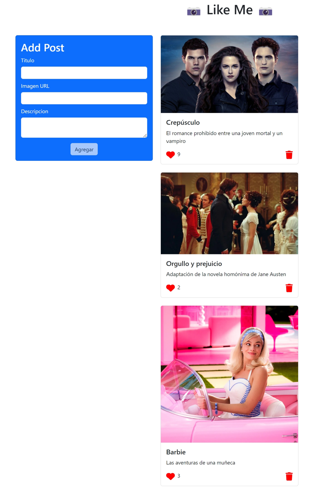
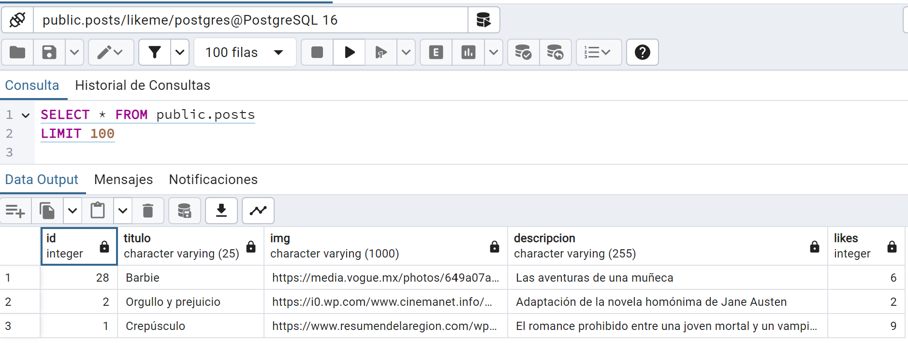
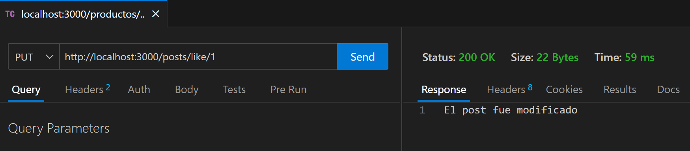

<h1 align="left"> Like Me - Parte 2 - Node </h1>

<h3 align="left">
Se muestran las evidencias de funcionamiento del backend con el frontend.
Además se utilizó el FRONT 2, el cual realiza un UPDATE al campo LIKE.
</h4>

```node
    export const likePost = async (id) => {
        await fetch(`${URL_API}/like/${id}`, {
            method: "PUT",
        });
    };
```





<h3 align="left">
Para ejecutar scripts de node desde la terminal, se ejecutar "npm i", luego "npm run dev" o "npm run start".
</h4>

```node
npm i

npm run dev
npm run start
```